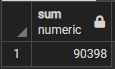
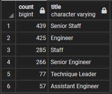
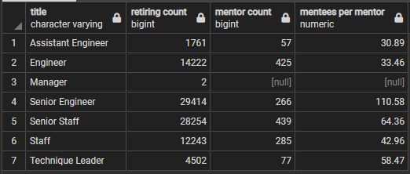

# Pewlett-Hackard-Analysis

## Overview of the Analysis
Using pgAdmin 4 and PostgreSQL I am helping the company Pewlett-Hackard (PH) query their employee database to prepare them for the upcoming round of retirees, or "silver tsunami".

The first part of this project was to find out how many employees will be retiring in the next few years and of those how many will be eligible for a retirement package. To do this, I needed to join multiple tables and filter through the database to find employees who were still employed by PH, born within a certain date range (1952 to 1955). This information was then organized to group these employees by their most recent title.

The second part of this project was to find out which employees would be eligible to participate in a mentorship program. This list was created by joining and filtering tables in the database for current employees born between a certain date range (during the year 1965).

## Results
#### Provide a bullet list with four major points from the two deliverables. Use images as support
- There are 7 different roles that employees will be retiring from:
  - Senior Engineer
  - Senior Staff
  - Engineer
  - Staff
  - Technique Leader
  - Assistant Engineer
  - Manager
- There is a large range in how many employees will be retiring from:
  - With 29,414 Senior Engineers retiring, and only 2 Managers retiring
- There are a total of 90,398 employees retiring
  - Using the following code: `SELECT COUNT(emp_no) FROM unique_titles;`
- There are a total of 1,549 employees who are mentorship eligible
  - Using the following code: `SELECT COUNT(emp_no) FROM mentorship_eligibility;`

## Summary
#### How many roles will need to be filled as the "silver tsunami" begins to make an impact?
By referencing the table retiring_titles, we can see the breakdown of how many employees of each role need to be filled. By running a `SUM` query, we can see the total number of employees nearing retirement is 90,398.

The number of employees retiring from each role (per retiring_titles table):

The total number of employees retiring (by running `SELECT SUM(count) FROM retiring_titles;`)

#### Are there enough qualified, retirement-ready employees in the department to mentor the next generation of Pewlett-Hackard employees?

Using a new query to count the number of mentorship eligible employees in each title, we can compare the number of employees retiring to those who are mentorship eligible, grouped by title.

Number of employees retiring from each role (per retiring_titles table):

Number of employees who are mentorship eligible (per mentorship_titles table):

By creating a new query and table comparing the two, we can see the number of employees each mentor would need to mentor to replace the number of employees retiring ("mentees per mentor" column in the following table):

Depending on how many mentees each mentor can handle, it is possible that the roles could be filled, however even the smallest gaps are quite large (ranging from ~30 mentees to ~110 mentees per mentor). There are also no Managers who are eligible for mentorship, which could present another problem.
